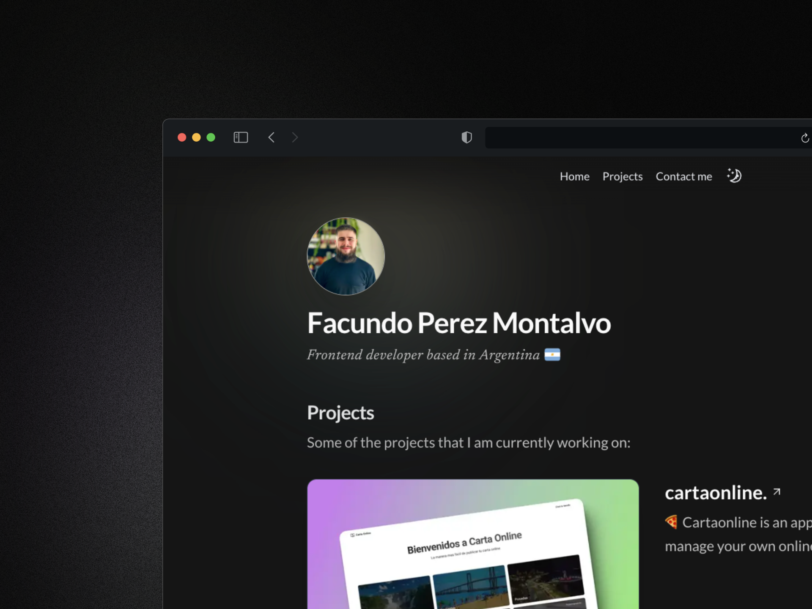

 
<h3>
 My portfolio
</h3>

This is my portfolio website made with Next.js and styled with Tailwind CSS

&nbsp;✦&nbsp;
<a href="http://facuperezm.com">Live website</a>
&nbsp;✦&nbsp;

## 📸 Screenshots

## 🛠️ Stack

- [**React**](https://reactjs.org/) - A JavaScript library for building user interfaces.
- [**Next.js 14**](https://nextjs.org/) - The React framework for building production-ready websites.
- [**Tailwind CSS**](https://tailwindcss.com/) - A utility-first CSS framework for rapidly building custom designs.
- [**Framer Motion**](https://www.framer.com/motion/) - A production-ready motion library for React.
- [**Emailjs**](https://www.emailjs.com/) - A cloud-based email service for sending emails directly from the frontend.
- [**React-hook-form**](https://react-hook-form.com/) - Performant, flexible, and extensible forms with easy-to-use React hooks.
- [**Zod**](https://github.com/colinhacks/zod) - A TypeScript-first schema declaration and validation library.

**Deploy:** Vercel

## Optimizations

- [x] Improve colors variables in Tailwind config file to use better conventions
- [x] Add dark mode
- [x] Dark/Light theme
- [x] Improve contact form validation and error handling
- [x] Add a toast message when sending the email
- [ ] Separate works in new page
- [ ] Add a new page for the blog

## Author

- [Facundo Perez Montalvo](https://facuperezm.vercel.app)

