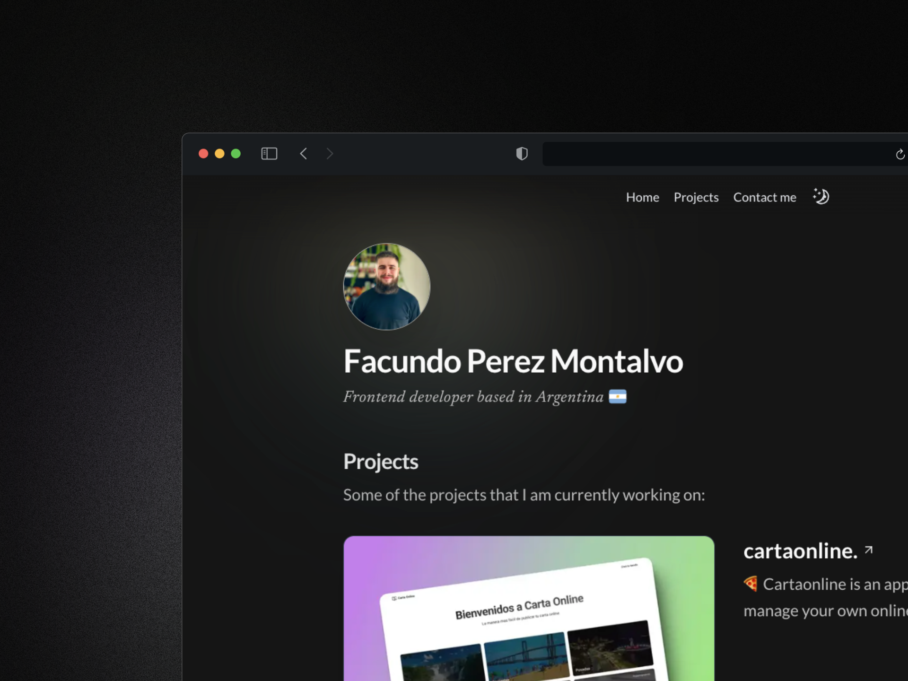

# Portfolio Website

My personal portfolio website built with Next.js, TypeScript, Tailwind CSS, and Framer Motion.

## Feel Free to Use! 🚀

Feel free to use this portfolio structure as inspiration for your own! If you do, I'd be super happy if you could give me a shoutout or mention [@facuperezm](https://github.com/facuperezm) in your README. 💙

## Tech Stack

 

## Features

- Modern and clean design
- Fully responsive
- Dark/Light mode
- Fast page loads
- SEO optimized
- Type-safe
- Contact form with email integration

## Tech Stack

- [**React**](https://reactjs.org/) - A JavaScript library for building user interfaces.
- [**Next.js 14**](https://nextjs.org/) - The React framework for building production-ready websites.
- [**Tailwind CSS**](https://tailwindcss.com/) - A utility-first CSS framework for rapidly building custom designs.
- [**Framer Motion**](https://www.framer.com/motion/) - A production-ready motion library for React.
- [**Emailjs**](https://www.emailjs.com/) - A cloud-based email service for sending emails directly from the frontend.
- [**React-hook-form**](https://react-hook-form.com/) - Performant, flexible, and extensible forms with easy-to-use React hooks.
- [**Zod**](https://github.com/colinhacks/zod) - A TypeScript-first schema declaration and validation library.

## Getting Started

1. Clone this repository
2. Install dependencies with `pnpm install`
3. Create a `.env` file based on `.env.example`
4. Run the development server with `pnpm run dev`

## License

MIT License - feel free to use this code for your own portfolio!

## Contact

If you have any questions, feel free to reach out to me:

